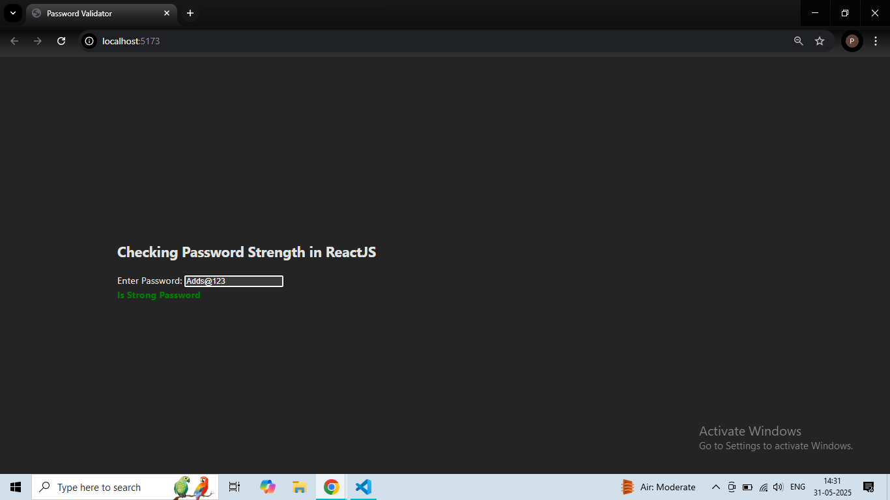

# REACT + validator.js
A simple and responsive React app that checks the strength of a password in real-time using the validator library.

✨ Features
✅ Real-time password validation as the user types

✅ Clear visual feedback with color-coded messages

✅ Uses validator library to enforce strong password criteria

✅ Clean and minimal UI

✅ Easy to integrate into any React project

🛡️ Password Strength Criteria
A password is considered strong if it includes:

At least 8 characters

At least 1 lowercase letter

At least 1 uppercase letter

At least 1 number

At least 1 special character (e.g., @, $, %, &)

📸 Demo

🧰 Technologies Used
React

validator.js

📦 Installation & Setup
1. Clone the Repository
  ``bash
  git clone https://github.com/your-username/password_validator.git
cd password_validator
2. Install Dependencies
  npm install
3. Install validator
   npm install validator
4. Start the Development Server
npm run dev
